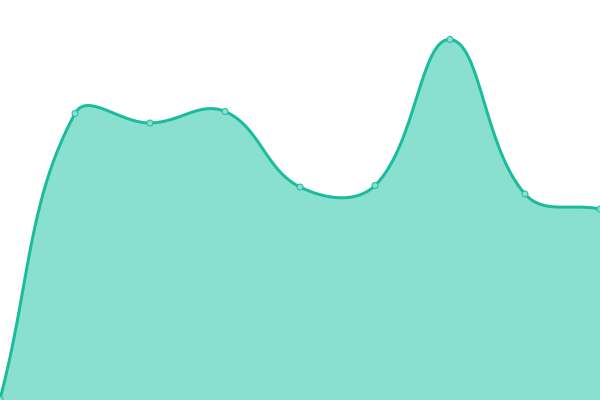
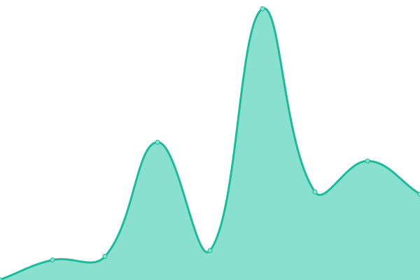
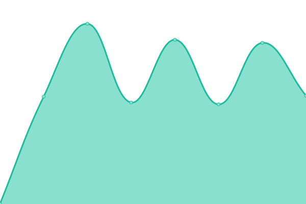
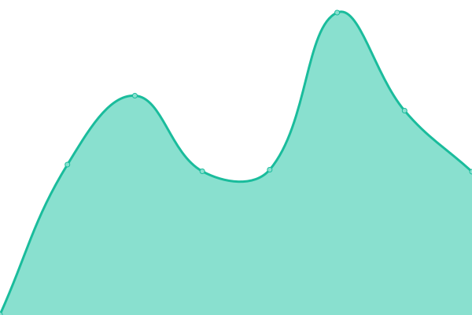
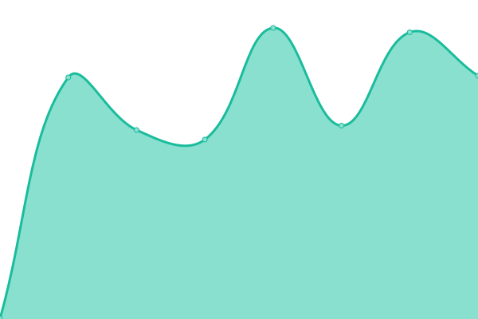
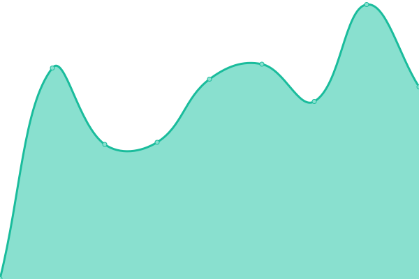

# [📈 Live Status](https://hamannjens.github.io/upptime): <!--live status--> **🟩 All systems operational**

This repository contains the open-source uptime monitor and status page for [Jens Hamann](https://hamannjens.github.io/upptime), powered by [Upptime](https://github.com/upptime/upptime).

With [Upptime](https://upptime.js.org), you can get your own unlimited and free uptime monitor and status page, powered entirely by a GitHub repository. We use [Issues](https://github.com/hamannjens/upptime/issues) as incident reports, [Actions](https://github.com/hamannjens/upptime/actions) as uptime monitors, and [Pages](https://hamannjens.github.io/upptime) for the status page.

<!--start: status pages-->
<!-- This summary is generated by Upptime (https://github.com/upptime/upptime) -->
<!-- Do not edit this manually, your changes will be overwritten -->
<!-- prettier-ignore -->
| URL | Status | History | Response Time | Uptime |
| --- | ------ | ------- | ------------- | ------ |
|  [Host1](85.214.41.81) | 🟩 Up | [host1.yml](https://github.com/hamannjens/upptime/commits/HEAD/history/host1.yml) | 

 124ms
     
 | 

<a href="https://status.jenshamann.solutions/history/host1">100.00%</a>
    

|  [CICD](https://cicd.jenshamann.solutions/userContent/readme.txt) | 🟩 Up | [cicd.yml](https://github.com/hamannjens/upptime/commits/HEAD/history/cicd.yml) | 

 512ms
     
 | 

<a href="https://status.jenshamann.solutions/history/cicd">100.00%</a>
    

|  [DBA1](https://dba1.jenshamann.solutions) | 🟩 Up | [dba-1.yml](https://github.com/hamannjens/upptime/commits/HEAD/history/dba-1.yml) | 

 576ms
     
 | 

<a href="https://status.jenshamann.solutions/history/dba-1">100.00%</a>
    

|  [Glances1](https://glances1.jenshamann.solutions) | 🟩 Up | [glances1.yml](https://github.com/hamannjens/upptime/commits/HEAD/history/glances1.yml) | 

 553ms
     
 | 

<a href="https://status.jenshamann.solutions/history/glances1">100.00%</a>
    

|  [Grafana1](https://grafana1.jenshamann.solutions) | 🟩 Up | [grafana1.yml](https://github.com/hamannjens/upptime/commits/HEAD/history/grafana1.yml) | 

 988ms
     
 | 

<a href="https://status.jenshamann.solutions/history/grafana1">99.91%</a>
    

|  [Health1](https://health1.jenshamann.solutions) | 🟩 Up | [health1.yml](https://github.com/hamannjens/upptime/commits/HEAD/history/health1.yml) | 

 462ms
     
 | 

<a href="https://status.jenshamann.solutions/history/health1">100.00%</a>
    

|  [Prometheus1](https://prometheus1.jenshamann.solutions) | 🟩 Up | [prometheus1.yml](https://github.com/hamannjens/upptime/commits/HEAD/history/prometheus1.yml) | 

 545ms
     
 | 

<a href="https://status.jenshamann.solutions/history/prometheus1">100.00%</a>
    

|  [WeatherV1](https://wetter.jenshamann.solutions/status.php) | 🟩 Up | [weather-v1.yml](https://github.com/hamannjens/upptime/commits/HEAD/history/weather-v1.yml) | 

 565ms
     
 | 

<a href="https://status.jenshamann.solutions/history/weather-v1">100.00%</a>
    

<!--end: status pages-->

[**Visit our status website →**](https://hamannjens.github.io/upptime)

## 📄 License

- Powered by: [Upptime](https://github.com/upptime/upptime)
- Code: [MIT](./LICENSE) © [Jens Hamann](https://hamannjens.github.io/upptime)
- Data in the `./history` directory: [Open Database License](https://opendatacommons.org/licenses/odbl/1-0/)
