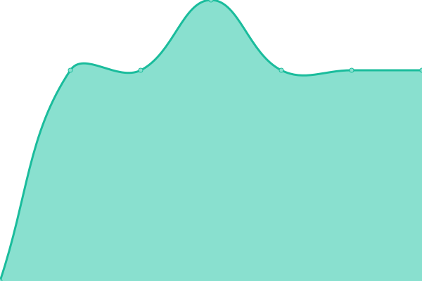

# [📈 Live Status](https://hamannjens.github.io/upptime): <!--live status--> **🟨 Degraded performance**

This repository contains the open-source uptime monitor and status page for [Jens Hamann](https://hamannjens.github.io/upptime), powered by [Upptime](https://github.com/upptime/upptime).

With [Upptime](https://upptime.js.org), you can get your own unlimited and free uptime monitor and status page, powered entirely by a GitHub repository. We use [Issues](https://github.com/hamannjens/upptime/issues) as incident reports, [Actions](https://github.com/hamannjens/upptime/actions) as uptime monitors, and [Pages](https://hamannjens.github.io/upptime) for the status page.

<!--start: status pages-->
<!-- This summary is generated by Upptime (https://github.com/upptime/upptime) -->
<!-- Do not edit this manually, your changes will be overwritten -->
<!-- prettier-ignore -->
| URL | Status | History | Response Time | Uptime |
| --- | ------ | ------- | ------------- | ------ |
|  Host1 | 🟨 Degraded | [host1.yml](https://github.com/hamannjens/upptime/commits/HEAD/history/host1.yml) | 

 136ms
     
 | 

<a href="https://status.jenshamann.solutions/history/host1">79.03%</a>
    

|  Host3 | 🟩 Up | [host3.yml](https://github.com/hamannjens/upptime/commits/HEAD/history/host3.yml) | 

 132ms
     
 | 

<a href="https://status.jenshamann.solutions/history/host3">91.08%</a>
    

|  Host4 | 🟩 Up | [host4.yml](https://github.com/hamannjens/upptime/commits/HEAD/history/host4.yml) | 

 134ms
     
 | 

<a href="https://status.jenshamann.solutions/history/host4">91.23%</a>
    

|  Host5 | 🟩 Up | [host5.yml](https://github.com/hamannjens/upptime/commits/HEAD/history/host5.yml) | 

 190ms
     
 | 

<a href="https://status.jenshamann.solutions/history/host5">84.55%</a>
    

|  Health1 | 🟨 Degraded | [health1.yml](https://github.com/hamannjens/upptime/commits/HEAD/history/health1.yml) | 

 438ms
     
 | 

<a href="https://status.jenshamann.solutions/history/health1">10.02%</a>
    

<!--end: status pages-->

[**Visit our status website →**](https://hamannjens.github.io/upptime)

## 📄 License

- Powered by: [Upptime](https://github.com/upptime/upptime)
- Code: [MIT](./LICENSE) © [Jens Hamann](https://hamannjens.github.io/upptime)
- Data in the `./history` directory: [Open Database License](https://opendatacommons.org/licenses/odbl/1-0/)
